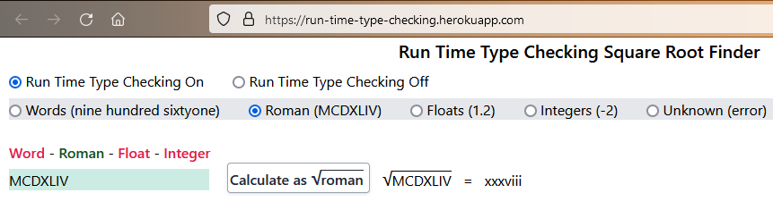

dealWithErrors looking for timeoutStop/lowDisk


why not stop on "s" ??? right away??? was on high
//////////////


This Go console program downloads podcast episodes to your local machine. 
Only new episodes are downloaded. Files are not erased. 


Can be used to test an RSS feed for missing files. 


#### Can be used to "back-up" a podcast

  -  Joe Rogan's podcasts are only on Spotify, except for the single #1109 in the RSS feed https://joeroganexp.libsyn.com/rss.

  -  The MP3 files of http://feeds.feedburner.com/PhpRoundtable are no longer accessible.

  - The Hardcore History podcast http://feeds.feedburner.com/dancarlin/history, only lists the last 14 episodes out of 69.


To run with a menu
```
    go run  ./
```




Or to just download new episodes of one podcast


  -  Black Box Down
    
      go run ./ feeds.megaphone.fm/blackboxdown --forceTitle


 -  Breaking Points with Krystal and Saagar
     
      go run ./  feeds.megaphone.fm/BRPL9803447123?_Breaking_Points_ --forceTitle


  -  Heist Podcast

      go run ./  heistpodcast.libsyn.com/rss


  -  Stuff You Should Know
      
      go run ./ omnycontent.com/d/playlist/e73c998e-6e60-432f-8610-ae210140c5b1/A91018A4-EA4F-4130-BF55-AE270180C327/44710ECC-10BB-48D1-93C7-AE270180C33E/podcast.rss?_Stuff_You_Should_Know_80GB_


  -  The Rest Is History 
      
      go run ./ rss.acast.com/the-rest-is-history-podcast

  - Timesuck with Dan Cummins

      go run ./ feeds.simplecast.com/Llc7KL2K?_Timesuck_with_Dan_Cummins_                --networkLoad=low/MEDIUM


  -  Witness History - BBC
    
      go run ./ podcasts.files.bbci.co.uk/p004t1hd.rss?_Witness_History_BBC_ 
      


////////////////////////////////////////
////////////////////////////////////////
////////////////////////////////////////

FIND PODCAST FEEDS
  - Use castos.com to <a href='https://castos.com/tools/find-podcast-rss-feed/'>find urls of feeds</a>

TESTS
    go clean -testcache 

  - Test everything
```
    go test ./src/tests_mocked_http/... ./src/tests_real_internet/... -count=1
```
  - Test only real Internet tests
```
    go test ./src/tests_real_internet/... -count=1
```
  - Test only mocked Internet tests
```
     go test ./src/tests_mocked_http/... -count=1
```


OPTIONAL ARGUMENTS
  - --forceTitle uses the title of each episode as the locally saved filename

      go run ./ --forceTitle

  - --networkLoad sets the amount of network traffic
      
      go run ./ --networkLoad=high
      
      go run ./ --networkLoad=medium
      
      go run ./ --networkLoad=low 

  - --fileLimit sets the maximum number of files to download from a podcast
    
      go run ./ --fileLimit=3

  - --emptyFiles podcasts are not actually read, used to check for file existance, all files are empty
    
      go run ./ --emptyFiles


////////////////////////////////////////
////////////////////////////////////////
////////////////////////////////////////

Useful Idiots with Matt Taibbi and Katie Halper
https://feeds.megaphone.fm/usefulidiots


go run ./  sffaudio.herokuapp.com/pdf/rss
rss.minDiskMbs

  - BBC News Top stories
      go run ./ podcasts.files.bbci.co.uk/p02nq0gn.rss?_BBC_News_Top_Stories_

go run ./  sffaudio.herokuapp.com/pdf/rss 

American Scandal
 go run ./ --emptyFiles rss.art19.com/american-scandal


  -  Nasa Image of the Day
  
      go run ./ --emptyFiles www.nasa.gov/rss/dyn/lg_image_of_the_day.rss


  -  The SFFaudio Public Domain PDF Page (example of missing files)

      go run ./ --emptyFiles sffaudio.herokuapp.com/pdf/rss 

  -  The History of the Twentieth Century

      go run ./ --emptyFiles history20th.libsyn.com/rss

  -  The Dollop with Dave Anthony and Gareth Reynolds

      go run ./ --emptyFiles www.omnycontent.com/d/playlist/885ace83-027a-47ad-ad67-aca7002f1df8/22b063ac-654d-428f-bd69-ae2400349cde/65ff0206-b585-4e2a-9872-ae240034c9c9/podcast.rss

  -  English News - NHK WORLD RADIO JAPAN

      go run ./ --emptyFiles www3.nhk.or.jp/rj/podcast/rss/english.xml

 -  Siberian Times - Ecology

      go run ./ --emptyFiles siberiantimes.com/ecology/rss/

  - BC Today from CBC Raido British Columbia
      go run ./ --emptyFiles www.cbc.ca/podcasting/includes/bcalmanac.xml


- Cautionary Tales
https://www.omnycontent.com/d/playlist/e73c998e-6e60-432f-8610-ae210140c5b1/c0ae8c6e-22f0-4e9b-ac1c-ae390037ac53/7f5a4714-6b10-4ccf-a424-ae390037ac70/podcast.rss


Coding Blocks
https://codingblocks.libsyn.com/rss

Go Time: Golang, Software Engineering
https://changelog.com/gotime/feed


Factually! with Adam Conover
https://feeds.megaphone.fm/STA7224687510


Heist Podcast
https://heistpodcast.libsyn.com/rss


History That Doesn't Suck
https://feeds.megaphone.fm/NSR6392631259


In Our Time
https://podcasts.files.bbci.co.uk/b006qykl.rss

Mark and Carrie
https://feeds.captivate.fm/mark-and-carrie/

Overheard at National Geographic
https://feeds.megaphone.fm/ESP6921732651


Radiolab 
https://feeds.feedburner.com/radiolab


Science Vs
https://feeds.megaphone.fm/sciencevs


The History of English Podcast
https://historyofenglishpodcast.com/feed/podcast/


The Weirdest Thing I Learned This Week
https://feeds.megaphone.fm/RECU9765916949

You're Dead To Me
https://podcasts.files.bbci.co.uk/p07mdbhg.rss


The WW2 Podcast
https://ww2podcast.libsyn.com/rss


Dan Carlin's Hardcore History
http://feeds.feedburner.com/dancarlin/history?format=xml


