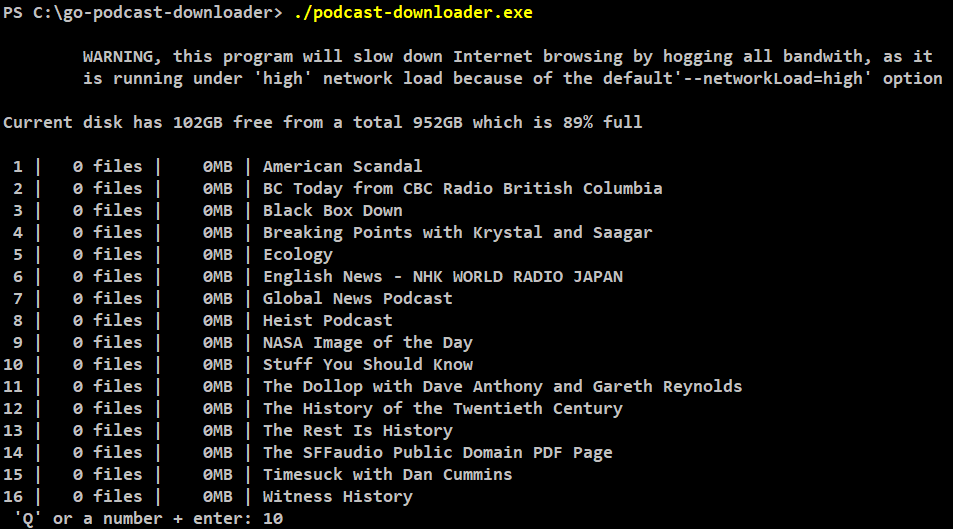
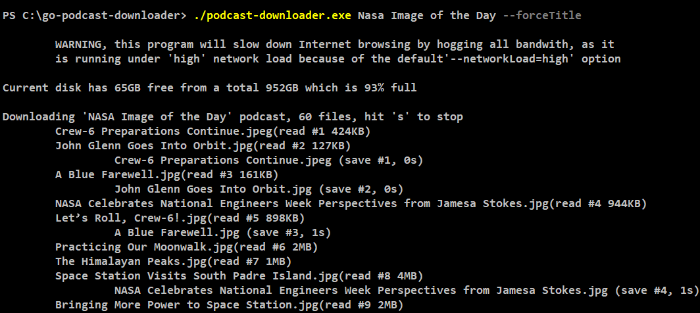
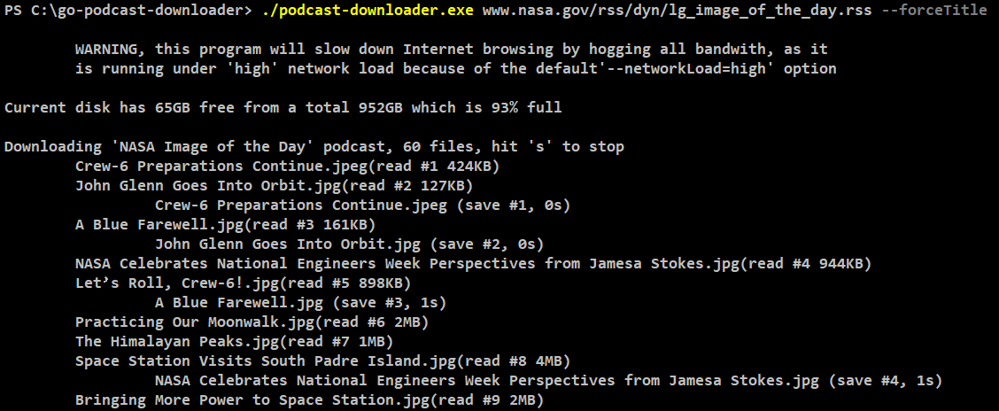

# Console podcast downloader written in Go. 

## For Backing-Up Podcasts

  -  Joe Rogan's podcasts are now only on Spotify, except for the single #1109 in the RSS feed https://joeroganexp.libsyn.com/rss. They used to be all publically available.

  -  The MP3 files of http://feeds.feedburner.com/PhpRoundtable are no longer accessible.

  - The Hardcore History podcast http://feeds.feedburner.com/dancarlin/history, only lists the last 14 episodes out of 69 released.


## For Checking Podcast Files
      
  - Check the existance of episode files
  
  - Verify filenames and/or episode titles and extensions

  - Make sure RSS XML file valid

  - See if episode hit counters work


## Start as Menu Driven 

```
    > ./podcast-downloader.exe
```



## Run For a Single "named" Podcast
```
    > ./podcast-downloader.exe Nasa Image of the Day --forceTitle
```



## Run for a Single "RRS file" 

```
    > ./podcast-downloader.exe www.nasa.gov/rss/dyn/lg_image_of_the_day.rss --forceTitle
```



## Non-Menu Single Podcast Examples

  - American Scandal
```
    > ./podcast-downloader.exe rss.art19.com/american-scandal
    > ./podcast-downloader.exe American Scandal
```


  - BBC News Top stories
```
    > ./podcast-downloader.exe podcasts.files.bbci.co.uk/p02nq0gn.rss?_BBC_News_Top_Stories_
    > ./podcast-downloader.exe BBC News Top stories
```

  - BC Today from CBC Raido British Columbia
```
    > ./podcast-downloader.exe www.cbc.ca/podcasting/includes/bcalmanac.xml
    > ./podcast-downloader.exe BC Today from CBC Raido British Columbia
```

  - Black Box Down
 ```   
    > ./podcast-downloader.exe feeds.megaphone.fm/blackboxdown --forceTitle
    > ./podcast-downloader.exe Black Box Down
```

 -  Breaking Points with Krystal and Saagar
```     
    > ./podcast-downloader.exe feeds.megaphone.fm/BRPL9803447123?_Breaking_Points_ --forceTitle
    > ./podcast-downloader.exe Breaking Points with Krystal and Saagar
```

  - English News - NHK WORLD RADIO JAPAN
```
    > ./podcast-downloader.exe www3.nhk.or.jp/rj/podcast/rss/english.xml
    > ./podcast-downloader.exe English News - NHK WORLD RADIO JAPAN
```

  - Heist Podcast
```
    > ./podcast-downloader.exe heistpodcast.libsyn.com/rss
    > ./podcast-downloader.exe Heist Podcast
```

  - Ecology (Siberian Times)
```
    > podcast-downloader.exe siberiantimes.com/ecology/rss/
    > podcast-downloader.exe Ecology
```

  - Nasa Image of the Day
```  
    > ./podcast-downloader.exe www.nasa.gov/rss/dyn/lg_image_of_the_day.rss --forceTitle
    > ./podcast-downloader.exe Nasa Image of the Day
```

  - Stuff You Should Know
 ```     
    > ./podcast-downloader.exe omnycontent.com/d/playlist/e73c998e-6e60-432f-8610-ae210140c5b1/A91018A4-EA4F-4130-BF55-AE270180C327/44710ECC-10BB-48D1-93C7-AE270180C33E/podcast.rss?_Stuff_You_Should_Know_
    > ./podcast-downloader.exe Stuff You Should Know
```

  - The Dollop with Dave Anthony and Gareth Reynolds
```
    > ./podcast-downloader.exe www.omnycontent.com/d/playlist/885ace83-027a-47ad-ad67-aca7002f1df8/22b063ac-654d-428f-bd69-ae2400349cde/65ff0206-b585-4e2a-9872-ae240034c9c9/podcast.rss?_The_Dollop_
    > ./podcast-downloader.exe The Dollop with Dave Anthony and Gareth Reynolds
```

  - The History of the Twentieth Century
```
    > ./podcast-downloader.exe history20th.libsyn.com/rss
    > ./podcast-downloader.exe The History of the Twentieth Century
```

  - The Rest Is History 
```      
    > ./podcast-downloader.exe rss.acast.com/the-rest-is-history-podcast
    > ./podcast-downloader.exe The Rest Is History
```

  - The SFFaudio Public Domain PDF Page (example of missing files)
 ```       
    > ./podcast-downloader.exe sffaudio.herokuapp.com/pdf/rss
    > ./podcast-downloader.exe The SFFaudio Public Domain PDF Page
```

  - Timesuck with Dan Cummins
```
    > ./podcast-downloader.exe feeds.simplecast.com/Llc7KL2K?_Timesuck_with_Dan_Cummins_
    > ./podcast-downloader.exe Timesuck with Dan Cummins
```

  - Witness History
 ```   
    > ./podcast-downloader.exe podcasts.files.bbci.co.uk/p004t1hd.rss?_Witness_History_BBC_ 
    > ./podcast-downloader.exe Witness History
```

## Finding Podcast Feeds
  - Use <a href='https://castos.com/tools/find-podcast-rss-feed/'>castos.com</a> to find urls of feeds


## [Compiling and Running Program From Source](./readme-compile.md)

