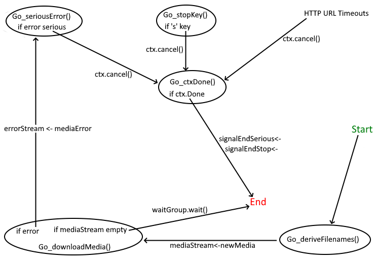

# Compiling and Running From Source

## Go Version 1.20 Required

  - <a href='https://go.dev/doc/install'>Download and Install Go</a>
```
    > go version
```


## Download Dependencies
```
    > go mod tidy
```

## Running From Source 

  - First time very slow as nothing is cached

```
    > go run  ./
```
## Compiling Executable
```
    > go build -o podcast-downloader.exe
```
## Running Executable
```
    > ./podcast-downloader.exe
```

## Testing
    go clean -testcache 

  - Test everything
```
    > go test ./src/tests_mocked_http/... ./src/tests_real_internet/... -count=1
```
  - Test only real Internet tests
```
    > go test ./src/tests_real_internet/... -count=1 -timeout 50s     

    > go test ./src/tests_real_internet/missing-file/... -count=1 -timeout 5s
```
  - Test only mocked Internet tests
```
    > go test ./src/tests_mocked_http/... -count=1
```

## Optional Arguments
  - --forceTitle uses the title of each episode as the locally saved filename.
  Needed for "Black Box Down", "Breaking Points", and "Nasa Image of the Day"
```
    >  go run ./ --forceTitle
```

  - --networkLoad sets the amount of network traffic, default is "high"
```      
    > go run ./ --networkLoad=high
      
    > go run ./ --networkLoad=medium
      
    > go run ./ --networkLoad=low 
```
  - --fileLimit sets the maximum number of files to download from a podcast
```
    > go run ./ --fileLimit=3
```
## Testing Arguments

  - "--emptyFiles" podcasts are not actually read, used to check for file existance and filenames, all files are empty
```    
    > go run ./ --emptyFiles
```
  - --logChannels will save all channel signalling in /src/channelLog.txt for debugging
```
    > go run ./ --logChannels
```


## Channels State Diagram
 



